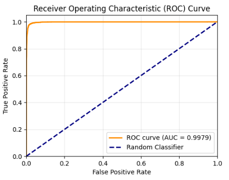
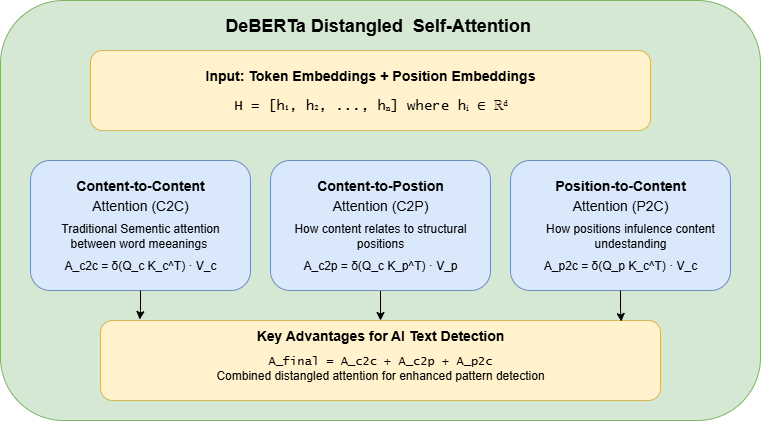

# **Official Repository of the Paper**: **_DeBERTa-Sentinel: An Explainable AI-Generated Text Detection Framework Using Disentangled Attention_**

Welcome to the official repository for the paper _"DeBERTa-Sentinel: An Explainable AI-Generated Text Detection Framework Using Disentangled Attention."_ This repository contains the datasets, models, and code used in our comprehensive study on AI-generated text detection.

## Repository Contents

### **Datasets**
- **MultiLLMText-Final Dataset**: Our enhanced dataset comprising 28,057 paraphrased samples generated using multiple LLMs (GPT-3.5, LLaMA, Claude)
- **OpenWebText-Final**: Approximately 29,142 human-written samples from the cleaned OpenWebText corpus
- **Complete Dataset**: 58,537 total samples with 80/20 train-test split (46,829 training, 11,708 testing)
- Complete dataset breakdown across 8 subsets (urlsf_00 to urlsf_06, urlsf_09)

### **Models**

**DeBERTa-Sentinel (Main Contribution)**:
- Enhanced detection framework leveraging DeBERTa-v3-small's disentangled attention mechanism
- End-to-end fine-tuned architecture with 256-token input sequences
- Achieves 97.65% detection accuracy with superior generalization capabilities

**Baseline Models**:
- **RoBERTa-Sentinel**: Comparative baseline using RoBERTa encoder
- **Traditional ML Models**: TF-IDF + Logistic Regression, Random Forest, and other classical approaches

### **Repository Structure**

**Main Model Implementation**:
- `HvsAI_Deberta_Sentinel_.ipynb`: Complete DeBERTa-Sentinel implementation and training pipeline

**Dataset Files**:
- `OpenGPTText_cSV_format/`: Dataset in CSV format containing the training data
- `Custom_Test_Final.csv`: Custom test dataset for evaluation

**Explainability Analysis**:
- `lime_explanation_sample_1.html`: LIME explainability visualization (Sample 1)
- `lime_explanation_sample_2.html`: LIME explainability visualization (Sample 2) 
- `lime_explanation_sample_3.html`: LIME explainability visualization (Sample 3)
- `lime_explanation_sample_4.html`: LIME explainability visualization (Sample 4)
- `lime_explanation_sample_5.html`: LIME explainability visualization (Sample 5)

**Documentation**:
- `README.md`: This comprehensive documentation file
- `.git/`: Git version control directory

### **Key Features**

**Disentangled Attention Architecture**:
- Content-to-Content attention for semantic relationship analysis
- Content-to-Position attention for structural pattern detection  
- Position-to-Content attention for templating behavior identification

**Performance Metrics**:
- **Accuracy: 97.65%**
- **F1-Score: 97.69%**
- **Precision: 96.15%**
- **Recall: 99.28%**
- **ROC-AUC: 99.79%** with near-perfect discrimination capability
- **Average Precision Score: 99.78%**
- **Optimal Threshold: 0.9985** with 98.12% TPR and 1.75% FPR

**Key Improvements**:
- 12.7% F1-score improvement over traditional ML baselines (TF-IDF + LogReg)
- 80.5% reduction in false negative rate compared to RoBERTa-Sentinel
- Superior generalization on distribution-shifted data

**Explainability Analysis**:
- Token-level contribution visualization using transformers-interpret pipeline
- Identification of formal transitional phrases and academic terminology as AI indicators
- Attention-based interpretability for understanding model decisions

## Results Summary

### Performance Comparison Across Models

| Model | Accuracy | F1-Score | Precision | Recall | AUC |
|-------|----------|----------|-----------|---------|-----|
| **DeBERTa-Sentinel** | **97.65%** | **0.9769** | **96.15%** | **99.28%** | **99.79%** |
| RoBERTa-Sentinel | 95.3% | 0.953 | 94.5% | 96.3% | - |
| TF-IDF + LogReg | 86.42% | 0.867 | 85.19% | 88.24% | - |
| Random Baseline | 49.06% | 0.491 | 49.15% | 49.05% | - |

### ROC Curve Analysis



*Figure 1: ROC curve for DeBERTa-Sentinel showing exceptional discrimination capability with 99.79% AUC. The near-perfect curve hugging the top-left corner demonstrates superior ability to distinguish between AI and human text compared to random classification.*

### F1-Score Comparison


*Figure 2: F1-score comparison across baseline models showing DeBERTa-Sentinel's performance (0.977) relative to traditional ML approaches, demonstrating a 12.7% improvement over TF-IDF + LogReg.*

### Performance Gains Over RoBERTa-Sentinel

| Metric | RoBERTa-Sentinel | DeBERTa-Sentinel | Improvement |
|--------|------------------|------------------|-------------|
| Detection Accuracy | 95.3% | 97.65% | +2.35pp |
| Precision | 94.5% | 96.15% | +1.65pp |
| Recall | 96.3% | 99.28% | +2.98pp |
| F1-Score | 95.3% | 97.69% | +2.39pp |
| False Negative Rate | 3.7% | 0.72% | -2.98pp (80.5% reduction) |
| False Positive Rate | 5.7% | 3.99% | -1.71pp |

### Commercial Detector Comparison

Performance comparison with commercial detectors from prior literature:

| Model | F1 Score | Source | Dataset |
|-------|----------|--------|---------|
| ZeroGPT | 0.43 | Chen et al. (2023) | OpenGPTText-Final |
| OpenAI Classifier | 0.32 | Chen et al. (2023) | OpenGPTText-Final |
| GPTZero | 0.40-0.75* | Weber-Wulff et al. (2023) | Various ChatGPT text |
| **RoBERTa-Sentinel** | **0.953** | This work | MultiLLMText-Final |
| **DeBERTa-Sentinel** | **0.977** | This work | MultiLLMText-Final |

*Range reported across different evaluation conditions

**Key Advantages over Commercial Systems**:
- Substantial F1-score improvements (0.977 vs 0.32-0.43 for commercial detectors)
- Token-level explainability enabling interpretation of detection decisions
- Model customization for domain-specific applications
- Methodological transparency supporting reproducible research
- Adaptability to emerging LLMs

## Model Architecture and Training

### DeBERTa-Sentinel Architecture

.png)

*Figure 3: The DeBERTa-Sentinel architecture. The input sequence is embedded and processed through 12 layers of disentangled attention. The final [CLS] token representation is used for classification via the internal feedforward layer. The architecture is fully end-to-end fine-tuned with gradients backpropagating through all layers of the encoder.*

### Disentangled Attention Mechanism



*Figure 4: DeBERTa's disentangled self-attention architecture for AI text detection, which separates traditional attention into three components: Content-to-Content (semantic relationships), Content-to-Position (how content relates to structure), and Position-to-Content (how position influences meaning). By analyzing content and structural patterns separately rather than together, this approach can detect subtle AI writing signatures like unnatural vocabulary usage, templating patterns, and content-position misalignments that distinguish AI-generated text from human writing.*

**Architecture Details**:
- **Base Model**: DeBERTa-v3-small (Microsoft/deberta-v3-small)
- **Architecture**: DebertaV2ForSequenceClassification
- **Encoder Layers**: 12 layers of disentangled attention
- **Max Token Length**: 256 tokens
- **Fine-Tuning Approach**: Full end-to-end fine-tuning (encoder + classifier)

### Training Configuration

| Hyperparameter | Value |
|----------------|-------|
| Epochs | 5 |
| Batch Size | 8 |
| Learning Rate | 2 × 10⁻⁵ |
| Weight Decay | 0 (default) |
| Optimizer | AdamW |
| Loss Function | Cross Entropy |
| Random Seed | 42 |

### Training Performance
- **Epoch 1 Accuracy**: 96.6%
- **Epoch 5 Accuracy**: 99.67%
- Demonstrates effective knowledge transfer from pre-trained model
- Rapid convergence with consistent improvement across epochs

## Dataset Details

### MultiLLMText-Final Dataset Composition

| Subset | GPT Generated | LLaMA Generated | Claude Generated |
|--------|---------------|-----------------|------------------|
| Urlsf_00 | 1,386 | 1,300 | 1,212 |
| Urlsf_01 | 1,308 | 1,300 | 801 |
| Urlsf_02 | 874 | 1,300 | 922 |
| Urlsf_03 | 1,299 | 1,300 | 1,295 |
| Urlsf_04 | 1,156 | 1,300 | 946 |
| Urlsf_05 | 1,103 | 1,300 | 1,164 |
| Urlsf_06 | 1,031 | 1,300 | 723 |
| Urlsf_09 | 1,217 | 1,300 | 1,220 |
| **Total** | **9,374** | **10,400** | **8,283** |

### Complete Dataset Statistics
- **Total AI-Generated Samples**: 28,057
- **Total Human-Written Samples**: ~29,142 (from OpenWebText-Final)
- **Complete Dataset**: 58,537 samples
- **Training Set**: 46,829 samples (80%)
- **Test Set**: 11,708 samples (20%)
- **Positive Class Ratio (Test Set)**: 0.501 (balanced)

### Data Source
Human-written samples obtained from the OpenWebText corpus, a publicly available dataset comprising web content sourced from URLs shared on Reddit with a minimum of three upvotes. The corpus was compiled in 2019, ensuring content was not algorithmically generated. We utilized the cleaned OpenWebText-Final subset from GPT-Sentinel with preprocessing to remove formatting inconsistencies.

### Data Collection Method
AI-generated samples created by paraphrasing cleaned human-written samples using the prompt: "Rephrase the following paragraph by paragraph." Samples longer than 2,000 words were filtered due to model input limitations. Content blocked by safety filters was excluded, and outputs were filtered for fluency and coherence.

## Usage Instructions

### Running DeBERTa-Sentinel
1. **Main Implementation**: Open `HvsAI_Deberta_Sentinel_.ipynb` in Google Colab or Jupyter Notebook
2. **Traditional ML Models**: Extract and run `HuLLMI_Paper_ML_Traditional_Model.zip` 
3. **Dataset Loading**: Use the CSV files in `OpenGPTText_cSV_format/` for training data
4. **Custom Testing**: Evaluate using `Custom_Test_Final.csv` for performance assessment

### Viewing Explainability Results
Open any of the LIME explanation HTML files (`lime_explanation_sample_1.html` to `lime_explanation_sample_5.html`) in a web browser to view:
- Token-level contribution analysis
- Feature importance visualization  
- Model decision interpretability

## Key Contributions

1. **Novel Architecture**: Introduction of DeBERTa-v3's disentangled attention mechanism for AI text detection, separating content and positional information during self-attention computation

2. **Enhanced Dataset**: MultiLLMText-Final dataset with 28,057 paraphrased samples from multiple LLMs (GPT-3.5, LLaMA, Claude) for improved generalization

3. **Superior Performance**: Consistent improvements over RoBERTa-Sentinel and traditional ML baselines:
   - 2.35 percentage point accuracy improvement (97.65% vs 95.3%)
   - 80.5% reduction in false negative rate
   - 12.7% F1-score improvement over TF-IDF + LogReg

4. **Interpretability**: Token-level explainability revealing discriminative patterns including formal transitional phrases and academic terminology as AI-indicative features

5. **Comprehensive Evaluation**: Extensive comparison with commercial and academic baselines demonstrating substantial improvements (F1: 0.977 vs 0.32-0.43 for commercial detectors)

## Explainability Insights

### Token-Level Feature Importance


*Figure 5: Top 20 most important features averaged across samples showing DeBERTa-Sentinel's learned patterns. High-importance words like "background" (0.254), "system" (0.216), and "Lemay" (0.144) indicate formal language structures that the model associates with AI-generated content.*

### Example Text Analysis


*Figure 6: Example of token-level explainability visualization showing how DeBERTa-Sentinel highlights specific words in a movie review. Orange highlighting indicates words that contribute toward AI classification, demonstrating the model's attention to formal transitional phrases like "Although" and structured language patterns.*

The model's decision-making process reveals:

- **Formal Language Detection**: Prioritization of formal vocabulary and structured language patterns (e.g., "background", "system")
- **Contextual Understanding**: Analysis of context rather than isolated words, identifying transitional phrases like "Although" in formal discourse
- **Stylistic Pattern Recognition**: Identification of characteristic LLM patterns such as formal conclusions ("demonstrates", "conclusion") and academic terminology
- **Balanced Analysis**: Use of both positive and negative feature contributions for robust classification

## Methodological Notes

### Model Selection and Hyperparameter Tuning
- 80/20 train/test split without separate validation set
- Hyperparameter selection followed established best practices from GPT-Sentinel work
- Training for 5 epochs with monitoring of training loss convergence patterns
- No explicit validation set to maximize training data utilization

### Methodological Limitations
The absence of a validation set represents a methodological limitation precluding systematic hyperparameter optimization. However, several factors mitigate overfitting concerns:
- Established hyperparameter values from prior work
- Strong performance on held-out test data (97.65% accuracy)
- Effective generalization on distribution-shifted scenarios
- Consistent convergence without overfitting signs

## Citation

If you use this work in your research, please cite:
```bibtex
@article{rehman2025deberta,
  title={DeBERTa-Sentinel: An Explainable AI-Generated Text Detection Framework Using Disentangled Attention},
  author={Rehman, Muhammad Yousaf and Islam, Muhammad and Hussain, Basharat},
  journal={IEEE Conference Proceedings},
  year={2025}
}
```

## Authors

**Muhammad Yousaf Rehman***  
SPECS, University of Hertfordshire, UK  
my.rehman007@gmail.com

**Muhammad Islam***  
College of Science and Engineering, James Cook University, Australia  
muhammad.islam1@jcu.edu.au

**Basharat Hussain**  
Department of Computer Science, NUCES, Pakistan  
basharat.hussian@nuces.edu.pk


## Abstract

The proliferation of large language models (LLMs) has created an urgent need for robust AI-generated text detection systems across domains including journalism, education, and legal applications. While transformer-based detectors like GPT-Sentinel have shown promise using RoBERTa encoders, they exhibit limited generalization across diverse model outputs and adversarial modifications. This study introduces DeBERTa-Sentinel, an enhanced detection framework architecture that leverages DeBERTa-v3's disentangled attention mechanism to improve upon existing approaches. Our proposed approach separates content and positional information during self-attention computation, enabling superior capture of subtle structural irregularities characteristic of synthetic text. We enhance training robustness by incorporating outputs from multiple LLMs (GPT-3.5, LLaMA, Claude) in our MultiLLMText-Final dataset, comprising 28,057 paraphrased samples. Comprehensive evaluation demonstrates that DeBERTa-Sentinel achieves superior performance compared to RoBERTa-Sentinel: 97.65% detection accuracy vs 95.3%, representing a 2.35 percentage point improvement. DeBERTa-Sentinel achieves 96.15% precision and 99.28% recall, compared to RoBERTa-Sentinel's 94.5% precision and 96.3% recall. The model exhibits superior generalization on distribution-shifted data, achieving 80.5% reduction in false negative rates. Explainability analysis reveals that DeBERTa-Sentinel effectively identifies formal transitional phrases and academic terminology as AI-indicative features. The model demonstrates 12.7% F1-score improvement over traditional machine learning baselines while providing token-level interpretability. These results validate disentangled attention as a promising architectural innovation for AI-generated content detection, with implications for forensic applications requiring high precision and interpretability.

---

**Repository Link**: https://github.com/Galileo-Galili/HUMAN-VS-AI-TEXT-DETECTION

**Note**: This repository contains the research implementation for the paper "DeBERTa-Sentinel: An Explainable AI-Generated Text Detection Framework Using Disentangled Attention." The paper is currently under review. For optimal visualization of LIME explainability analysis and attention mechanisms, please open the notebook files in Google Colab or Jupyter Notebook, and view the HTML explainability files in a web browser.
